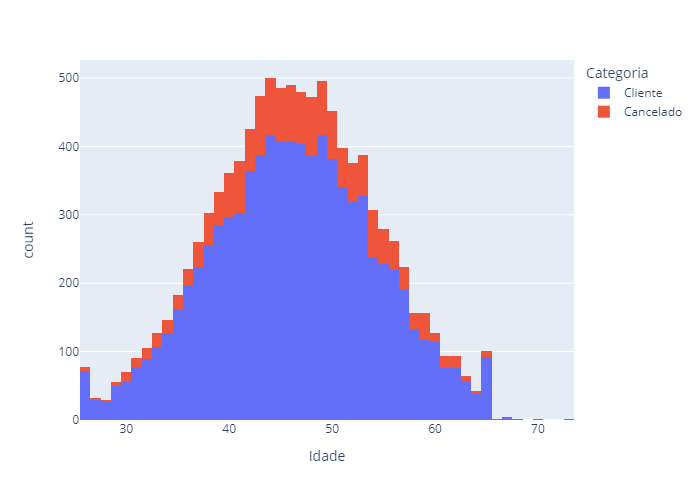

### Desafio
#### Em uma empresa de cartões de crédito, o número de clientes que cancelam seus cartões têm aumentado significativamente. Quais insights você pode extrair a partir da base de dados disponibilizada no link abaixo:

#### Referência: https://www.kaggle.com/sakshigoyal7/credit-card-customers

### O que temos?

#### A base de dados possui informações dos clientes ativos e cancelados.

### Iniciando a análise

#### Todas as análises foram feitas em Python 3.12 a partir do VSCode em uma máquina Windows


1. Importar a biblioteca Pandas e exibir dados da tabela

```python
import pandas as pd

# Carrega os dados do arquivo CSV
tabela = pd.read_csv('C:\\Users\\mcaro\\Google Drive\\Hashtag\\ClientesBanco.csv', encoding='latin1')

# Exibe uma amostra da tabela de dados usando print()
print(tabela)
```
```
       CLIENTNUM  Categoria  Idade Sexo  Dependentes           Educação  \
0      768805383    Cliente     45    M            3       Ensino Médio   
1      818770008    Cliente     49    F            5    Ensino Superior   
2      713982108    Cliente     51    M            3    Ensino Superior   
3      769911858    Cliente     40    F            4       Ensino Médio   
4      709106358    Cliente     40    M            3  Sem ensino formal   
...          ...        ...    ...  ...          ...                ...   
10122  772366833    Cliente     50    M            2    Ensino Superior   
10123  710638233  Cancelado     41    M            2      Não informado   
10124  716506083  Cancelado     44    F            1       Ensino Médio   
10125  717406983  Cancelado     30    M            2    Ensino Superior   
10126  714337233  Cancelado     43    F            2    Ensino Superior   

        Estado Civil Faixa Salarial Anual Categoria Cartão  \
0             Casado          $60K - $80K             Blue   
1           Solteiro       Less than $40K             Blue   
2             Casado         $80K - $120K             Blue   
3      Não informado       Less than $40K             Blue   
4             Casado          $60K - $80K             Blue   
...              ...                  ...              ...   
10122       Solteiro          $40K - $60K             Blue   
10123     Divorciado          $40K - $60K             Blue   
10124         Casado       Less than $40K             Blue   
10125  Não informado          $40K - $60K             Blue   
10126         Casado       Less than $40K           Silver   

       Meses como Cliente  ...  Inatividade 12m  Contatos 12m   Limite  \
0                      39  ...                1             3  12691.0   
1                      44  ...                1             2   8256.0   
2                      36  ...                1             0   3418.0   
3                      34  ...                4             1   3313.0   
4                      21  ...                1             0   4716.0   
...                   ...  ...              ...           ...      ...   
10122                  40  ...                2             3   4003.0   
10123                  25  ...                2             3   4277.0   
10124                  36  ...                3             4   5409.0   
10125                  36  ...                3             3   5281.0   
10126                  25  ...                2             4  10388.0   

       Limite Consumido  Limite Disponível  Mudanças Transacoes_Q4_Q1  \
0                   777            11914.0                   1335.000   
1                   864             7392.0                   1541.000   
2                     0             3418.0                   2594.000   
3                  2517              796.0                   1405.000   
4                     0             4716.0                   2175.000   
...                 ...                ...                        ...   
10122              1851             2152.0                      0.703   
10123              2186             2091.0                      0.804   
10124                 0             5409.0                      0.819   
10125                 0             5281.0                      0.535   
10126              1961             8427.0                      0.703   

       Valor Transacoes 12m  Qtde Transacoes 12m  \
0                      1144                   42   
1                      1291                   33   
2                      1887                   20   
3                      1171                   20   
4                       816                   28   
...                     ...                  ...   
10122                 15476                  117   
10123                  8764                   69   
10124                 10291                   60   
10125                  8395                   62   
10126                 10294                   61   

       Mudança Qtde Transações_Q4_Q1  Taxa de Utilização Cartão  
0                           1625.000                      0.061  
1                           3714.000                      0.105  
2                           2333.000                      0.000  
3                           2333.000                      0.760  
4                              2.500                      0.000  
...                              ...                        ...  
10122                          0.857                      0.462  
10123                          0.683                      0.511  
10124                          0.818                      0.000  
10125                          0.722                      0.000  
10126                          0.649                      0.189  

[10127 rows x 21 columns]
```   
 
2. Listar informações da tabela

```python
# Exibe o tipo de dado em cada coluna da tabela
print(tabela.info())
```
```
<class 'pandas.core.frame.DataFrame'>
RangeIndex: 10127 entries, 0 to 10126
Data columns (total 21 columns):
 #   Column                         Non-Null Count  Dtype  
---  ------                         --------------  -----  
 0   CLIENTNUM                      10127 non-null  int64  
 1   Categoria                      10127 non-null  object 
 2   Idade                          10127 non-null  int64  
 3   Sexo                           10127 non-null  object 
 4   Dependentes                    10127 non-null  int64  
 5   Educação                       10127 non-null  object 
 6   Estado Civil                   10127 non-null  object 
 7   Faixa Salarial Anual           10127 non-null  object 
 8   Categoria Cartão               10126 non-null  object 
 9   Meses como Cliente             10127 non-null  int64  
 10  Produtos Contratados           10127 non-null  int64  
 11  Inatividade 12m                10127 non-null  int64  
 12  Contatos 12m                   10127 non-null  int64  
 13  Limite                         10127 non-null  float64
 14  Limite Consumido               10127 non-null  int64  
 15  Limite Disponível              10127 non-null  float64
 16  Mudanças Transacoes_Q4_Q1      10127 non-null  float64
 17  Valor Transacoes 12m           10127 non-null  int64  
 18  Qtde Transacoes 12m            10127 non-null  int64  
 19  Mudança Qtde Transações_Q4_Q1  10127 non-null  float64
 20  Taxa de Utilização Cartão      10127 non-null  float64
dtypes: float64(5), int64(10), object(6)
memory usage: 1.6+ MB
None
```

3. Remover linhas com dados faltantes - ver "Categoria Cartão"

```python
# Remover linhas "na" da tabela
import pandas as pd
tabela = pd.read_csv('C:\\Users\\mcaro\\Google Drive\\Hashtag\\ClientesBanco.csv', encoding='latin1')
tabela = tabela.dropna()
print(tabela.info())
```
```
<class 'pandas.core.frame.DataFrame'>
Index: 10126 entries, 0 to 10126
Data columns (total 21 columns):
 #   Column                         Non-Null Count  Dtype  
---  ------                         --------------  -----  
 0   CLIENTNUM                      10126 non-null  int64  
 1   Categoria                      10126 non-null  object 
 2   Idade                          10126 non-null  int64  
 3   Sexo                           10126 non-null  object 
 4   Dependentes                    10126 non-null  int64  
 5   Educação                       10126 non-null  object 
 6   Estado Civil                   10126 non-null  object 
 7   Faixa Salarial Anual           10126 non-null  object 
 8   Categoria Cartão               10126 non-null  object 
 9   Meses como Cliente             10126 non-null  int64  
 10  Produtos Contratados           10126 non-null  int64  
 11  Inatividade 12m                10126 non-null  int64  
 12  Contatos 12m                   10126 non-null  int64  
 13  Limite                         10126 non-null  float64
 14  Limite Consumido               10126 non-null  int64  
 15  Limite Disponível              10126 non-null  float64
 16  Mudanças Transacoes_Q4_Q1      10126 non-null  float64
 17  Valor Transacoes 12m           10126 non-null  int64  
 18  Qtde Transacoes 12m            10126 non-null  int64  
 19  Mudança Qtde Transações_Q4_Q1  10126 non-null  float64
 20  Taxa de Utilização Cartão      10126 non-null  float64
dtypes: float64(5), int64(10), object(6)
memory usage: 1.7+ MB
None
```

4. Exibir as principais estatísticas das variávei de dados

```python
# Exibindo as principais estatíticas da tabela
import pandas as pd
tabela = pd.read_csv('C:\\Users\\mcaro\\Google Drive\\Hashtag\\ClientesBanco.csv', encoding='latin1')
tabela = tabela.dropna()
print(tabela.describe())
```
```
          CLIENTNUM         Idade   Dependentes  Meses como Cliente  \
count  1.012600e+04  10126.000000  10126.000000        10126.000000   
mean   7.391700e+08     46.327079      2.346139           35.928995   
std    3.689769e+07      8.016420      1.298956            7.986593   
min    7.080821e+08     26.000000      0.000000           13.000000   
25%    7.130365e+08     41.000000      1.000000           31.000000   
50%    7.179256e+08     46.000000      2.000000           36.000000   
75%    7.731328e+08     52.000000      3.000000           40.000000   
max    8.283431e+08     73.000000      5.000000           56.000000   

       Produtos Contratados  Inatividade 12m  Contatos 12m        Limite  \
count          10126.000000     10126.000000  10126.000000  10126.000000   
mean               3.812463         2.341300      2.455264   8631.962088   
std                1.554440         1.010584      1.106267   9089.225428   
min                1.000000         0.000000      0.000000   1438.300000   
25%                3.000000         2.000000      2.000000   2555.000000   
50%                4.000000         2.000000      2.000000   4549.000000   
75%                5.000000         3.000000      3.000000  11067.750000   
max                6.000000         6.000000      6.000000  34516.000000   

       Limite Consumido  Limite Disponível  Mudanças Transacoes_Q4_Q1  \
count      10126.000000       10126.000000               10126.000000   
mean        1162.764369        7469.197719                 108.713167   
std          815.012238        9091.132356                 353.912795   
min            0.000000           3.000000                   0.000000   
25%          358.000000        1324.250000                   0.631000   
50%         1276.000000        3473.000000                   0.736000   
75%         1784.000000        9860.000000                   0.859000   
max         2517.000000       34516.000000                3397.000000   

       Valor Transacoes 12m  Qtde Transacoes 12m  \
count          10126.000000         10126.000000   
mean            4404.391764            64.861841   
std             3397.157925            23.471594   
min              510.000000            10.000000   
25%             2156.000000            45.000000   
50%             3899.500000            67.000000   
75%             4741.000000            81.000000   
max            18484.000000           139.000000   

       Mudança Qtde Transações_Q4_Q1  Taxa de Utilização Cartão  
count                   10126.000000               10126.000000  
mean                       66.579995                   0.274901  
std                       284.001363                   0.275704  
min                         0.000000                   0.000000  
25%                         0.582000                   0.023000  
50%                         0.702000                   0.175500  
75%                         0.818000                   0.503000  
max                      3714.000000                   0.999000  
```

5. Exibir principais estatísticas das variávei de dados com duas casas decimais

```python
# Exibindo as principais estatíticas da tabela
import pandas as pd
tabela = pd.read_csv('C:\\Users\\mcaro\\Google Drive\\Hashtag\\ClientesBanco.csv', encoding='latin1')
tabela = tabela.dropna()
print(tabela.describe(). round(2))
```
```
          CLIENTNUM     Idade  Dependentes  Meses como Cliente  \
count  1.012600e+04  10126.00     10126.00            10126.00   
mean   7.391700e+08     46.33         2.35               35.93   
std    3.689769e+07      8.02         1.30                7.99   
min    7.080821e+08     26.00         0.00               13.00   
25%    7.130365e+08     41.00         1.00               31.00   
50%    7.179256e+08     46.00         2.00               36.00   
75%    7.731328e+08     52.00         3.00               40.00   
max    8.283431e+08     73.00         5.00               56.00   

       Produtos Contratados  Inatividade 12m  Contatos 12m    Limite  \
count              10126.00         10126.00      10126.00  10126.00   
mean                   3.81             2.34          2.46   8631.96   
std                    1.55             1.01          1.11   9089.23   
min                    1.00             0.00          0.00   1438.30   
25%                    3.00             2.00          2.00   2555.00   
50%                    4.00             2.00          2.00   4549.00   
75%                    5.00             3.00          3.00  11067.75   
max                    6.00             6.00          6.00  34516.00   

       Limite Consumido  Limite Disponível  Mudanças Transacoes_Q4_Q1  \
count          10126.00           10126.00                   10126.00   
mean            1162.76            7469.20                     108.71   
std              815.01            9091.13                     353.91   
min                0.00               3.00                       0.00   
25%              358.00            1324.25                       0.63   
50%             1276.00            3473.00                       0.74   
75%             1784.00            9860.00                       0.86   
max             2517.00           34516.00                    3397.00   

       Valor Transacoes 12m  Qtde Transacoes 12m  \
count              10126.00             10126.00   
mean                4404.39                64.86   
std                 3397.16                23.47   
min                  510.00                10.00   
25%                 2156.00                45.00   
50%                 3899.50                67.00   
75%                 4741.00                81.00   
max                18484.00               139.00   

       Mudança Qtde Transações_Q4_Q1  Taxa de Utilização Cartão  
count                       10126.00                   10126.00  
mean                           66.58                       0.27  
std                           284.00                       0.28  
min                             0.00                       0.00  
25%                             0.58                       0.02  
50%                             0.70                       0.18  
75%                             0.82                       0.50  
max                          3714.00                       1.00  

```

6. Quantificar Clientes Ativos e Clientes Cancelados

```python
# Quantidade de clientes Ativos versus Cancelados
qtd_categoria = tabela['Categoria'].value_counts()
print(qtd_categoria)

# Percentual de clientes Ativos versus Cancelados
perc_categoria = tabela['Categoria'].value_counts(normalize=True).round(2)
print(perc_categoria)
```
```
# quantidade
Categoria
Cliente      8499
Cancelado    1627
Name: count, dtype: int64

% percentual
Categoria
Cliente      0.84
Cancelado    0.16
Name: proportion, dtype: float64
```

7. Comparando: Clientes Ativos versus Clientes Cancelados

```python
# Histograma Contagem de Clientes x Idade
import plotly.express as px
grafico = px.histogram(tabela, x='Idade', color='Categoria')
grafico.show()
```

```
8. Exibir colunas da tabela

```python
# Listando colunas da tabela
import plotly.express as px
for coluna in tabela:
    print(coluna)
```

9. Exibir histograma de clientes Ativos versus Cancelados a partir das variaveis de colunas

```python
# Histogramas diversos com todas as variaveis das colunas
import plotly.express as px
for coluna in tabela:
    print(coluna)
    grafico = px.histogram(tabela, x=coluna, color='Categoria', title=f'Histograma de {coluna}', width=700, height=500)
    grafico.show()
```
